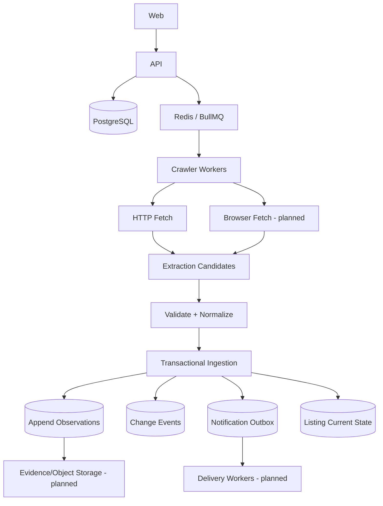

# Architecture

## Current target system

## Implemented boundary

The durable backend spine now includes PostgreSQL persistence plus Redis/BullMQ worker delivery. The deterministic in-memory store remains useful for pure tests but is no longer treated as the production idempotency authority.

## Core pipeline

`URL -> security policy -> fetch -> extraction candidates -> validation -> normalization -> DB transaction -> append observation -> change detection -> outbox/current-state materialization`

## Delivery model

BullMQ may redeliver a crawl after a worker dies. PostgreSQL constraints and transactions make replay safe. Queue-level custom job IDs reduce duplicate scheduling, while database `job_key` and `crawl_run_id` uniqueness prevent duplicate business effects.

## Non-negotiable invariants

1. Observations are append-oriented facts.
2. A failed crawl cannot create a successful observation.
3. `last_successful_crawl_at` changes only after validated observation persistence.
4. Tenant relationships are constrained by workspace at both database and application boundaries.
5. Production HTTP fetches bind validated DNS answers to the actual socket connection and revalidate every redirect hop.
6. Unknown availability remains `UNKNOWN`.
7. Conflicting high-confidence extraction candidates fail explicitly rather than silently selecting a value.
8. Worker replay must not duplicate observations, change events, or notification intent.
