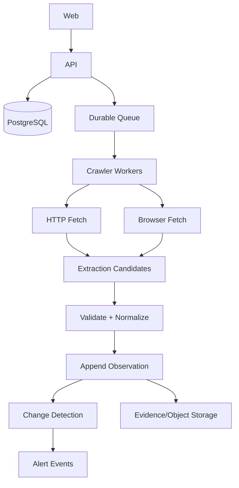

# Architecture

## Target system

## Implemented foundation boundary

The current commit implements dependency-free domain and crawler primitives plus deterministic fixture-based vertical tests. It deliberately does not pretend an in-memory store is the production database or that direct function calls are a durable queue.

## Core pipeline

`URL -> security policy -> fetch -> extraction candidates -> validation -> normalization -> append observation -> change detection -> health/current-state materialization`

## Non-negotiable invariants

1. Observations are append-oriented facts.
2. A failed crawl cannot create a successful observation.
3. `lastSuccessfulCrawlAt` changes only after validated observation persistence.
4. Cross-workspace access is rejected in repository/domain APIs.
5. Production network fetches validate initial URL and each redirect destination against SSRF policy.
6. Extraction candidates carry source method and confidence; candidate disagreement will be represented rather than silently hidden as adapters mature.
