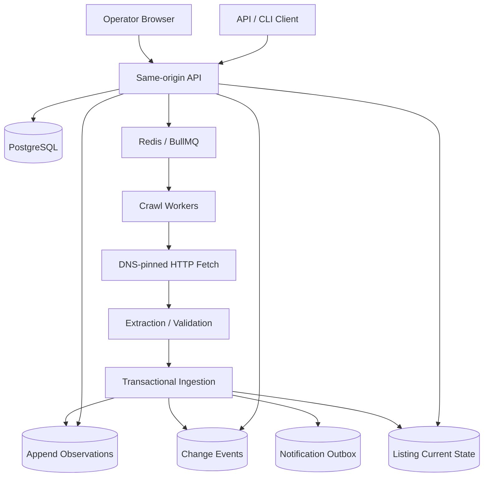
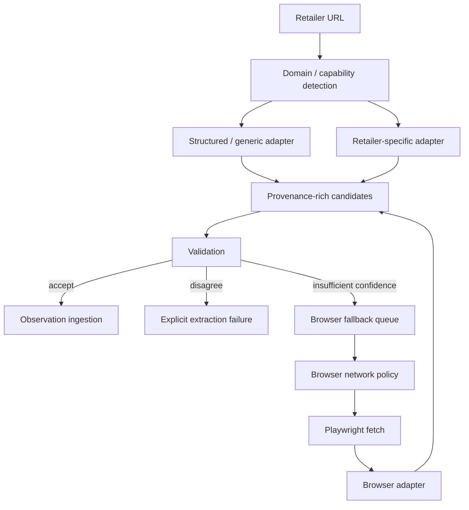

# Architecture

## Current system

The browser authenticates with an HttpOnly cookie; API/CLI callers may use explicit Bearer sessions. Both converge on the same hashed-session store and workspace authorization boundary.

## Implemented operator vertical

`Browser -> auth -> workspace -> product -> competitor listing -> POST crawl -> durable QUEUED crawl identity -> BullMQ -> worker -> hardened HTTP fetch -> JSON-LD extraction -> PostgreSQL transaction -> listing/history query -> browser polling/render`

The verified E2E exercises `$100 HEALTHY -> $90 PRICE_CHANGED -> malformed page PARSE_FAILED` and proves the last verified `$90` remains visible without being represented as fresh.

## Migration/deployment model

Schema migrations are ordered, checksum-validated, advisory-lock protected, and transactionally applied. Production services should not independently mutate schema on every process startup.

Target deployment order:

`deploy artifact -> migration job -> API -> workers`

Local development may opt into API/worker auto-migration.

## Delivery model

BullMQ is at-least-once. Queue custom IDs reduce duplicate scheduling, but PostgreSQL uniqueness and transactions are the correctness authority. Worker death after DB commit and before queue ACK is explicitly tested.

## Non-negotiable invariants

1. Observations are append-oriented verified facts.
2. A failed crawl cannot create a successful observation.
3. Current listing state advances only with the chronological verified head.
4. `last_successful_crawl_at` advances only with accepted newest verified state.
5. Tenant access is enforced at API and DB relationship boundaries.
6. HTTP production fetches bind validated DNS answers to the actual connection and revalidate redirects.
7. Unknown availability remains `UNKNOWN`.
8. Conflicting high-confidence candidates fail explicitly rather than silently selecting one.
9. Worker replay cannot duplicate observations, changes, or notification intent.
10. Browser cookie secrets are not exposed to JavaScript, and unsafe cookie-authenticated writes require same-origin CSRF validation.

## Next architecture program — Retailer Reliability

Extraction now needs to become a plugin/adapter system rather than a growing set of retailer conditionals.

Each candidate should carry adapter ID/version, extraction method, source/selector, confidence, seller/stock/price/currency, and an evidence reference or trace identifier where retained.

## Reliability measurement architecture

Deterministic CI remains the release gate:

`fixtures -> adapter contracts -> persistence/integration -> operator browser E2E`

Live retailer checks are nondeterministic and should be separated:

`scheduled/manual canary -> controlled URL corpus -> attempt metrics -> correctness sample -> retailer health report`

Live-canary data must distinguish transport success, extraction success, and manually verified correctness. A parser returning a number is not evidence that it returned the correct product price.

## Browser fallback constraint

The existing HTTP SSRF boundary is not sufficient for Playwright. Before browser fallback becomes production-capable, request interception/network policy must prevent the initial navigation and all browser-originated subrequests from reaching private/local destinations. Browser contexts must also be isolated across jobs/tenants.

The cheapest sufficiently reliable path should win; Chromium must not become the default fetch method for every listing.
