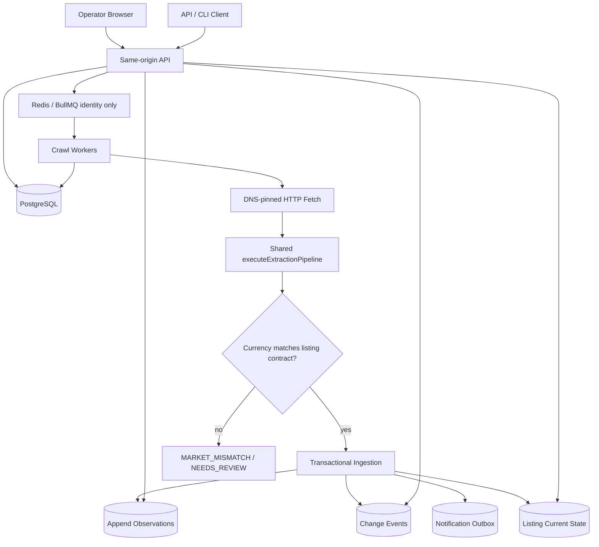
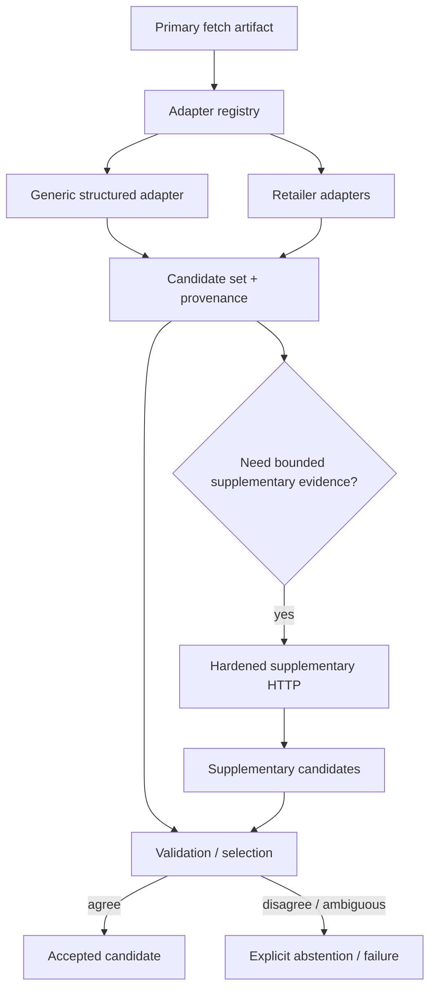

# Architecture

## Current system

The browser authenticates with an HttpOnly cookie; API/CLI callers may use explicit Bearer sessions. Both converge on the same hashed-session store and workspace authorization boundary.

PostgreSQL is also the authoritative crawl-configuration boundary. BullMQ carries only `workspaceId`, `listingId`, `crawlRunId`, and `jobKey`. At execution time the worker reloads the product ID, current listing URL, `expected_currency`, `market_country`, and `locale` from PostgreSQL.

## Operator vertical

`Browser -> auth -> workspace -> product -> competitor listing -> POST crawl -> durable QUEUED crawl identity -> BullMQ identity -> worker reloads listing from Postgres -> hardened HTTP fetch -> shared extraction pipeline -> market guard -> PostgreSQL transaction -> listing/history query -> browser polling/render`

The verified E2E exercises `$100 HEALTHY -> $90 PRICE_CHANGED -> malformed page PARSE_FAILED` and proves the last verified `$90` remains visible without being represented as fresh.

## Migration/deployment model

Schema migrations are ordered, checksum-validated, advisory-lock protected, and transactionally applied. Production services should not independently mutate schema on every process startup.

Target deployment order:

`deploy artifact -> migration job -> API -> workers`

Local development may opt into API/worker auto-migration.

Migration `004_listing_market_context.sql` introduces the listing market contract and backfills `expected_currency` from the parent product before making it non-null.

## Delivery model

BullMQ is at-least-once. Queue custom IDs reduce duplicate scheduling, but PostgreSQL uniqueness and transactions are the correctness authority. Worker death after DB commit and before queue ACK is explicitly tested.

The queue intentionally does **not** contain authoritative URL/product/market fields. `enqueueCrawl()` reconstructs the persisted payload from identity fields only, and the worker reloads current configuration from PostgreSQL. This prevents stale queue data from silently overriding a later listing configuration change.

## Extraction architecture

Retailer-specific and generic adapters are already behind one registry. Matching adapters emit provenance-rich candidates rather than a first-match winner.

Production workers, live reliability measurement, and deterministic extraction tests share `executeExtractionPipeline()`. The measurement system is therefore an observer of production extraction policy rather than a second crawler implementation.

Candidates carry adapter ID/version, extraction method, source path, confidence, seller/stock/price/currency, and bounded attempt/provenance metadata.

## Market-context invariant

A monitored listing has:

- `expected_currency` — non-null enforced observation currency;
- `market_country` — optional intended country;
- `locale` — optional intended locale.

For newly created API listings, `expected_currency` defaults to the parent product currency unless explicitly configured.

Current enforcement is intentionally minimal and safe:

`worker reloads listing -> extract candidate -> candidate.currency == expected_currency ? ingest : MARKET_MISMATCH`

A mismatch is classified `NEEDS_REVIEW`. It creates no observation, no history row, no current-price/current-currency mutation, no change event, no notification intent, and does not advance `last_successful_crawl_at`. It does update the latest crawl attempt/failure metadata.

`persistObservationAndEffects()` repeats the currency check under the listing row lock, so alternate callers cannot bypass the worker-level guard.

`market_country` and `locale` are stored market intent, not a claim that all retailers are actively localized today. Retailer-specific localization can be added later without weakening the currency invariant.

## Non-negotiable invariants

1. Observations are append-oriented verified facts.
2. A failed crawl cannot create a successful observation.
3. Current listing state advances only with the chronological verified head.
4. `last_successful_crawl_at` advances only with accepted newest verified state.
5. Tenant access is enforced at API and DB relationship boundaries.
6. HTTP production fetches bind validated DNS answers to the actual connection and revalidate redirects.
7. Unknown availability remains `UNKNOWN`.
8. Conflicting high-confidence candidates fail explicitly rather than silently selecting one.
9. Worker replay cannot duplicate observations, changes, or notification intent.
10. Browser cookie secrets are not exposed to JavaScript, and unsafe cookie-authenticated writes require same-origin CSRF validation.
11. BullMQ is not authoritative for crawl URL/product/market configuration.
12. An unexpected observation currency can never be persisted as a verified listing observation.

## Reliability measurement architecture

Deterministic CI remains the release gate:

`fixtures -> adapter contracts -> persistence/integration -> operator browser E2E`

Live retailer checks remain nondeterministic and separate:

`scheduled/manual canary -> controlled URL corpus -> shared extraction pipeline -> decision truth -> retailer health report`

Decision truth distinguishes expected observations, expected variant abstentions, unavailable pages, and blocked states. Reporting separately measures observation coverage, price correctness, abstention correctness, unsafe unexpected observations, false abstentions, and overall decision accuracy.

The reusable Chromium truth-audit script is an independent verifier. Its screenshots, visible page state, bounded control probes, and verifier review can establish truth; its automatically extracted snippets never feed production observations.

## Accepted Shopify v1 baseline

The frozen 20-URL / 5-store Shopify corpus is accepted for `shopify@1.3.0`:

- 15/15 expected observations correctly priced;
- 4/4 expected variant ambiguities correctly abstained;
- 1/1 unavailable page correctly classified;
- zero wrong prices;
- zero unsafe unexpected observations;
- zero false abstentions;
- 100% decision accuracy on this measured corpus.

The corrected Shopify 1.2 replay against the same truth scored 95%, with Stag Matches as the sole false abstention. The Scindapsus truth label was corrected after browser/source evidence proved both CAD 14.95 and CAD 26.95 variants were live; production logic was not changed to satisfy the earlier incorrect oracle.

This baseline must not be generalized into “100% accurate on Shopify.”

## Production browser fallback constraint

A production browser crawler/fallback is still disabled. Playwright request interception is defense-in-depth, not equivalent to the raw HTTP transport's socket-level DNS pinning.

Before any production `page.goto(userUrl)` path, browser workers require:

- private/local destination rejection for initial and subresource requests;
- redirect and websocket policy;
- service-worker restrictions;
- isolated browser contexts across tenants/jobs;
- navigation/request/byte/time budgets;
- restrictive deployment-level private-network egress denial;
- hostile-page regressions.

Explicit retailer challenge pages remain `BLOCKED`; browser fallback must not become anti-bot circumvention.

## Next architecture program — Best Buy source reliability

Shopify is frozen unless a regression or deliberate corpus expansion reopens it.

Next sequence:

1. identify an acceptable Best Buy structured/public/licensed source;
2. do not rely on the current public developer API for PriceIntel's intended third-party price-analysis use without a suitable written agreement;
3. build deterministic contracts for an acceptable source;
4. create a bounded real Best Buy corpus and measure source access, extraction, decision truth, latency, bytes, and failure classes;
5. preserve `MANUAL_REVIEW` where source rights or semantics are unresolved.

After that: Walmart acceptable-source strategy, then production browser fallback only for genuinely render-dependent, non-blocked retailers.
