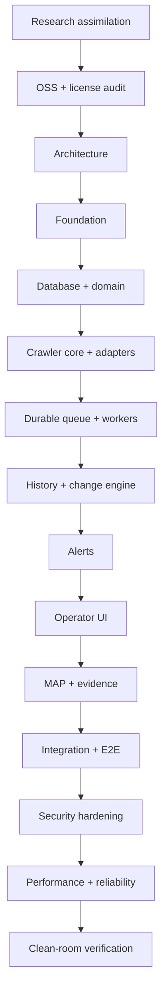

# Work Graph and Gates

The project is intentionally executed as bounded slices. A node is not complete until implementation, positive/negative verification, evidence, and documentation exist.

## Current gate

Foundation/crawler-core gate is partially passed:

- deterministic fixture extraction: PASS;
- append-only observation/history behavior: PASS in deterministic store;
- price and stock change detection: PASS;
- failure honesty: PASS;
- tenant boundary in domain store: PASS;
- SSRF primitive/security tests: PASS;
- PostgreSQL integration: NOT RUN / not implemented;
- durable queue/worker: NOT RUN / not implemented;
- production UI: NOT RUN / not implemented.

The first complete product vertical slice remains open until the real DB, durable queue/worker and UI replace the deterministic harness.
